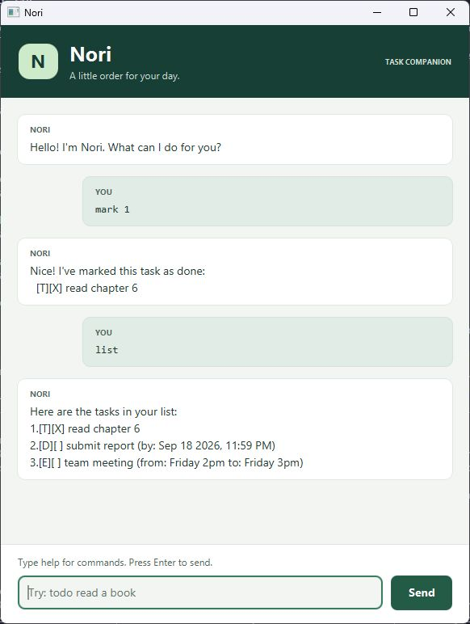

# Nori User Guide

Nori is a desktop task companion for keeping track of things to do, deadlines,
and events. Type a short command, and Nori keeps your task list on your computer.



## Quick start

1. Install **Java 25**. Run `java -version` in a terminal to check your version.
2. Download `nori.jar` from [Nori releases](https://github.com/h0nh0nbaguette/ip/releases)
   and place it in a folder you can write to.
3. Open a terminal in that folder and run `java -jar nori.jar`.
4. Type `todo read a book` in the input box, then press **Enter** or click **Send**.
   Type `list` to see your tasks, or `help` for a command summary.

You can resize the window. Long replies wrap, and the conversation scrolls to
new messages. Errors have an orange **NEEDS ATTENTION** label; the command stays
selected in the input box so you can replace or edit it.

## Command reference

Words in CAPITALS below are placeholders: replace them with your own values.
Use lower-case command words. Do not type the placeholders themselves.

| Action | Format | Example |
| --- | --- | --- |
| Add a to-do | `todo DESCRIPTION` | `todo read chapter 6` |
| Add a deadline | `deadline DESCRIPTION /by DATE_TIME` | `deadline submit report /by 2026-09-18 2359` |
| Add an event | `event DESCRIPTION /from START /to END` | `event team meeting /from Friday 2pm /to Friday 3pm` |
| Show all tasks | `list` | `list` |
| Mark as done | `mark NUMBER` | `mark 2` |
| Mark as incomplete | `unmark NUMBER` | `unmark 2` |
| Delete a task | `delete NUMBER` | `delete 2` |
| Search descriptions | `find KEYWORD` | `find report` |
| Show help | `help` | `help` |
| Exit | `bye` | `bye` |

### Add tasks

**To-do:** use `todo` for a task without a date. A description is required.

```text
todo read chapter 6
```

Nori confirms the new task and the total number of tasks:

```text
Got it. I've added this task:
  [T][ ] read chapter 6
Now you have 1 task in the list.
```

**Deadline:** include a description and a real date with a 24-hour time.
Accepted formats are `yyyy-MM-dd HHmm` and `d/M/yyyy HHmm`.
For example, these commands specify the same deadline:

```text
deadline submit report /by 2026-09-18 2359
deadline submit report /by 18/9/2026 2359
```

The deadline is displayed as `Sep 18 2026, 11:59 PM`. Include the time even if you
only care about the date; `0000` means midnight at the start of that date.
Impossible dates (such as 30 February) and invalid times are rejected.

**Event:** include a description and both endpoints, in `/from` then `/to` order.

```text
event team meeting /from Friday 2pm /to Friday 3pm
```

Event endpoints are free text, unlike deadline dates. Nori displays them as
entered and does not check chronological order. Use meaningful, non-empty values.

Keep a space around `/by`, `/from`, and `/to` as shown. Leading and trailing
spaces are ignored; spaces within descriptions are retained. Duplicate tasks
are allowed, so submitting an add command twice creates two entries.

### List, complete, and delete tasks

`list` displays every task in insertion order. `[T]` means to-do, `[D]` means
deadline, and `[E]` means event. `[ ]` means incomplete and `[X]` means completed.

```text
Here are the tasks in your list:
1.[T][ ] read chapter 6
2.[D][X] submit report (by: Sep 18 2026, 11:59 PM)
3.[E][ ] team meeting (from: Friday 2pm to: Friday 3pm)
```

Use `mark 1` to complete the first task, and `unmark 1` to make it incomplete
again. Completed tasks stay in the list. Repeating either command is safe.

Use `delete 1` to remove the first task permanently. **There is no undo.**
Later tasks move up one number, so run `list` again before your next change.
Task numbers start at 1 and must refer to an existing task in the full list.

### Find tasks

`find report` shows descriptions containing `report`. Search is **case-sensitive**
and matches substrings: `find book` matches both `read book` and `return books`,
while `find Book` does not match either. You can also search a phrase, such as
`find team meeting`.

Search results are numbered separately. **Run `list` before marking, unmarking,
or deleting a search result**: those commands always use full-list numbers.
Searching never changes your stored tasks.

### Get help and exit

Type `help` to show the command summary in the conversation. Type `bye` or close
the window to exit. Commands such as `help`, `list`, and `bye` take no arguments.

## Saving your tasks

Successful task changes are saved automatically to `data/nori.txt`, relative to
the folder from which you launched Nori. The folder and file are created on first
use. Launch from the same folder next time to load the same tasks.

The conversation is not saved; use `list` after reopening to see your tasks.
To back up your tasks, close Nori and copy `data/nori.txt` somewhere safe. Avoid
editing the data file manually or running two copies against the same file.

## If something goes wrong

| Problem | What to do |
| --- | --- |
| Unknown command | Use a lower-case command from `help`, with no extra arguments for `list`, `help`, or `bye`. |
| Missing description or parameter | Follow the format in the error message; every task needs a description. |
| Invalid task number | Run `list`, then use one of its numbers. |
| Invalid deadline | Include a real date and four-digit 24-hour time, e.g. `2026-09-18 2359`. |
| No search results | Check spelling and capitalisation, or try a shorter keyword. |
| Cannot create, read, or save data | Check that the launch folder is writable and that `data` is a folder, not a file. Resolve the problem and retry the command. |
| Invalid stored data | Close Nori, keep a copy of `data/nori.txt`, and restore a known-good backup. To start empty, move the damaged file elsewhere before reopening. |

If loading fails, Nori reports the error and blocks task commands rather than
overwriting the damaged file. `help` and `bye` still work. If saving fails, the
change is not confirmed; resolve the problem and use `list` to check saved tasks
before retrying.
